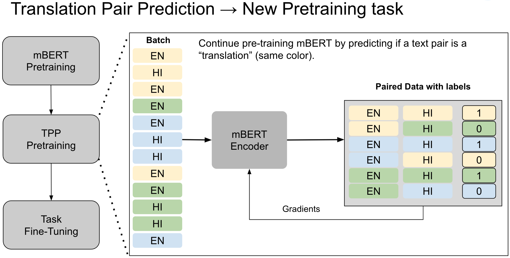

# [Improved Multilingual Language Model Pretraining for Social Media Text via Translation Pair Prediction](https://arxiv.org/abs/2110.10318)

[](https://colab.research.google.com/github/twitter-research/multilingual-alignment-tpp) [](https://mybinder.org/v2/gh/twitter-research/multilingual-alignment-tpp/HEAD)



Code for reproducing the paper **[Improved Multilingual Language Model Pretraining for Social Media Text via Translation Pair Prediction](https://arxiv.org/abs/2110.10318)** to appear at [The 7th Workshop on Noisy User-generated Text (W-NUT)](http://noisy-text.github.io/2021/) organized at EMNLP 2021. 

## Citation
 
 Please cite as:
 
 > Mishra, S., & Haghighi, A. (2021). Improved Multilingual Language Model Pretraining for Social Media Text via Translation Pair Prediction. Proceedings of the 7th Workshop on Noisy User-generated Text (W-NUT 2021). [arXiv](https://arxiv.org/abs/2110.10318)
 
 
 ```bibtex
@inproceedings{mishra2021tpp,
  title={Improved Multilingual Language Model Pretraining for Social Media Text via Translation Pair Prediction},
  author={Mishra, Shubhanshu and Haghighi, Aria},
  booktitle={Proceedings of the 7th Workshop on Noisy User-generated Text (W-NUT 2021)},
  year={2021},
  address={Online},
  publisher={Association for Computational Linguistics},
  pages={1--6},
  eprint={2110.10318},
  archivePrefix={arXiv},
  primaryClass={cs.CL}
}
 ```


## Reproducibility

Following steps allow reproducing experiments in the paper:

1. Run mBERT finetuning
2. Fine-tune on specific task (NER, POS, Sentiment).

Both steps can be run via files in `./notebooks/`. 

More details in the paper.

## Datasets

We provide example formats of the datasets in the `/data` folder. The NER data for English, Arabic, and Japanese is internal. 
Details for processing data can be found in `./src` folder. 


## Security Issues?

Please report sensitive security issues via Twitter's bug-bounty program (https://hackerone.com/twitter) rather than GitHub.

